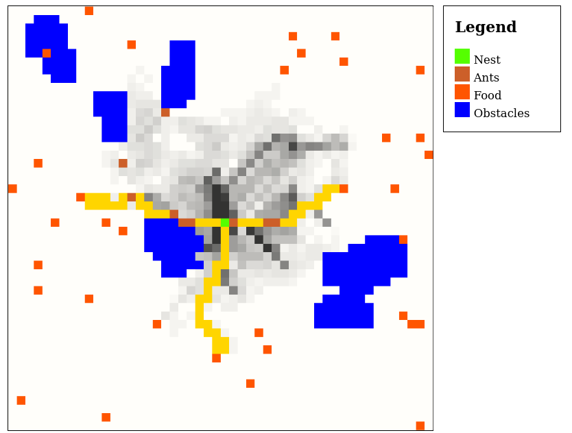

# Ant colony simulation

A simulation of an ant colony with ants scavenging for food sources.

Ants scavenge for food moving randomly. When they find food sources, they go back to the nest leaving a "scent" that is followed by other ants. Each time an ant steps on a cell, it makes it more likely that other ants will choose that same path when going back to the nest. Close to ideal paths between the nest and the food sources emerge as a result. Read this [blog post](https://onestepcode.com/ant-colony-simulation/) for more details.

[Live demo](https://onestepcode.com/demo-ant-colony-simulation/index.html) (code may not be up to date with repo)

Forked from [must-compute](https://sr.ht/~must-compute/).

## Running the simulation

Run the simulation with:

```sh
$ npm start
```

Alternatively, open `index.html` on your preferred browser.

TypeScript source code is located in `src/`. It can be compiled to JavaScript with the TypeScript compiler. Output will be written to `build/`.

Compile with:

```sh
$ npm run build
```

Or simply run TypeScript compiler:

```sh
$ tsc
```

You can install `tsc` as follows if needed:

```sh
$ npm install -g typescript
```

## Dependencies

- [p5.js](https://p5js.org/).

## License

GPL.
